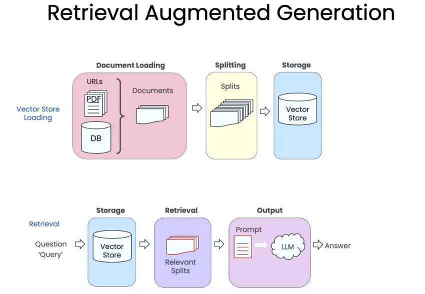

# 改进总览
## 检索部分
- 使用ensemble检索集成pm25与向量检索
- 返回父文档

# RAG最佳实践
## RAG标准流程

## RAG提升搜索精度的方法
Last part we have already used the similarity_search method. On top of that, we also have other methods.

- Basic semantic similarity -基本语义相似
- Maximum Marginal Relevance(MMR)
- Metadata -元数据
- LLM Aided Retrieval

**好像还可以结合PM25之类的，然后做ranking之类的**
在检索增强生成（RAG）等场景中，除了基础的`similarity_search`（基于语义相似度的检索），你提到的这四种方法（基础语义相似度、MMR、元数据检索、LLM辅助检索）是更精细化的检索策略，各自解决不同的问题。以下是详细解析：


### 一、Basic Semantic Similarity（基础语义相似度检索）
这是最基础、最常用的检索方式，也是`similarity_search`的核心原理。

#### 核心原理
- 将查询文本（query）和文档（document）都转换为高维向量（通过嵌入模型，如BERT、Sentence-BERT等）；
- 计算查询向量与文档向量之间的**相似度分数**（常用余弦相似度、欧氏距离等）；
- 按分数从高到低排序，返回最相似的Top N文档。

#### 特点
- **优点**：简单直接，易于实现，适用于大多数基础检索场景（如“找与‘机器学习入门’最相关的文档”）；
- **缺点**：可能返回冗余结果（例如多个内容高度重复的文档），且仅依赖语义相似度，忽略了结果的多样性或结构化约束。

#### 应用场景
- 基础问答、文档快速定位等对“相关性”要求高于“多样性”的场景。


### 二、Maximum Marginal Relevance (MMR，最大边际相关性)
MMR是为解决“基础语义检索结果冗余”而设计的策略，核心是**平衡“与查询的相关性”和“结果的多样性”**。

#### 核心原理
- 首先通过基础语义检索得到一批高相关性文档（候选集）；
- 从候选集中迭代选择文档：每次选择的文档需满足两个条件——① 与查询的相关性尽可能高；② 与已选文档的相似度尽可能低（避免重复）；
- 用公式可简化为：`MMR(document) = λ×similarity(document, query) - (1-λ)×max(similarity(document, already_selected_documents))`，其中`λ`是权重（λ越接近1，越侧重相关性；越接近0，越侧重多样性）。

#### 特点
- **优点**：减少冗余，提供更丰富的结果（例如查询“人工智能的影响”时，既返回技术影响，也返回社会影响，而非重复的技术分析）；
- **缺点**：计算成本高于基础检索（需多次计算文档间相似度），且`λ`的取值需要调优。

#### 应用场景
- 需要多角度回答的问题（如“气候变化的原因”）、推荐系统（如“推荐与‘科幻电影’相关但类型多样的影片”）。


### 三、Metadata Retrieval（元数据检索）
元数据检索是基于文档的**结构化元信息**（而非内容语义）进行过滤或排序的策略，常与语义检索结合使用。

#### 核心原理
- 元数据指文档的结构化标签，例如：
  - 文档属性：作者、发布时间、来源（如“期刊”“博客”）、格式（如“PDF”“视频”）；
  - 内容标签：主题分类（如“科技”“教育”）、关键词（人工标注或自动提取）、语言（如“中文”“英文”）；
- 检索时，先通过元数据过滤（如“只保留2023年后发布的英文文档”），再对过滤后的结果进行语义相似度排序；或直接用元数据匹配（如“找作者为‘张三’的文档”）。

#### 特点
- **优点**：可精准过滤特定约束条件（如“只看近3年的论文”），减少无关候选集，提升检索效率；
- **缺点**：依赖元数据的完整性和准确性（若元数据缺失或错误，会导致漏检/误检），且无法处理无元数据的文档。

#### 应用场景
- 有明确结构化约束的检索（如“找2020-2023年发表的关于‘量子计算’的中文论文”）；
- 多维度筛选（如“从B站视频中找与‘Python教程’相关、播放量超10万的内容”）。


### 四、LLM Aided Retrieval（LLM辅助检索）
LLM辅助检索是利用大语言模型（LLM，如GPT、Claude）的理解能力优化检索流程，弥补传统检索的不足。

#### 核心原理
LLM的作用体现在检索的多个环节：
1. **查询优化（Query Rewriting）**：将模糊的原始查询转换为更精准的检索式。例如，用户问“怎么用Python做数据可视化？”，LLM可优化为“Python 数据可视化 库（Matplotlib/Seaborn） 教程 代码示例”，提升基础检索的准确性；
2. **结果重排序（Reranking）**：对基础语义检索返回的结果，用LLM重新打分。传统语义相似度可能忽略上下文逻辑（如“苹果”在“苹果手机”和“苹果水果”中的歧义），而LLM可结合上下文判断真正相关性；
3. **多轮检索决策**：复杂问题需要多步检索时，LLM可规划检索步骤。例如，用户问“2023年诺贝尔物理学奖得主的研究对量子计算有何影响？”，LLM会先检索“2023诺奖得主及研究”，再检索“该研究与量子计算的关联”。

#### 特点
- **优点**：利用LLM的语义理解能力（如歧义消解、上下文推理）解决传统检索的局限性，大幅提升复杂场景的检索准确性；
- **缺点**：计算成本高（LLM调用耗时耗资源），且依赖LLM的自身能力（若LLM理解错误，会误导检索）。

#### 应用场景
- 复杂问题检索（如多步推理问题）、模糊查询（用户表达不清晰时）、需要上下文理解的场景（如歧义词处理）。


### 总结：四种方法的对比
| 方法               | 核心目标                     | 优势                          | 劣势                          | 典型场景                     |
|--------------------|------------------------------|-------------------------------|-------------------------------|------------------------------|
| 基础语义相似度     | 最大化与查询的语义相关性     | 简单、高效                    | 结果可能冗余                  | 基础问答、文档快速定位       |
| MMR                | 平衡相关性与多样性           | 减少冗余，结果更丰富          | 计算成本高，需调参            | 多角度回答、推荐系统         |
| 元数据检索         | 基于结构化信息过滤           | 精准约束，提升效率            | 依赖元数据质量                | 有明确条件的检索（如时间、作者） |
| LLM辅助检索       | 用LLM优化检索全流程          | 解决复杂语义问题，提升准确性  | 成本高，依赖LLM能力           | 复杂问题、模糊查询           |


在实际应用中，这些方法常结合使用（例如：先用元数据过滤时间范围，再用LLM优化查询，最后用MMR返回多样化结果），以兼顾效率、准确性和用户体验。


# 基于harry项目的改进计划
**总述，项目改进分成两个部分，生成faiss向量数据库之前涉及到专业的维修文本；向量数据库之后可以大体沿用原来的rag框架**
## 三步走
从虚构小说（哈利波特）转向技术性强的设备维修手册，需要对整个流程进行一系列的改进。

我们将按照从易到难的顺序，详细讲解如何改造 `functions_for_pipeline.py` 这个项目基础。

---

### 改进路线图：从小说专家到维修大师

`functions_for_pipeline.py` 中的代理本质上是一个**“规划-检索-回答”**的通用框架。要让它适应新领域，我们需要在每个环节进行调整。

#### 级别一：简单入门 (快速让系统跑起来)

这是最基础的“换汤不换药”阶段，只需替换数据和微调提示，就能让代理在新领域上运行，尽管效果可能不佳。

1.  **更换数据源 (最简单)：**
    *   **当前做法:** 项目加载 `Harry_Potter_Book_1_The_Sorcerers_Stone.pdf`。
    *   **改进方法:** 将 `hp_pdf_path` 变量指向你的设备维修手册 PDF 文件。

2.  **重建向量数据库：**
    *   **当前做法:** 代码加载名为 `chunks_vector_store`, `chapter_summaries_vector_store` 等的本地 FAISS 索引。这些索引里全是哈利波特的内容。
    *   **改进方法:** **必须删除旧的索引文件**，然后重新运行 `sophisticated_rag_agent_harry_potter.ipynb` 中的数据预处理部分（PDF 加载、切分、创建摘要、生成向量并保存）。这样才能生成一个包含维修手册知识的全新向量数据库。**这是让 RAG 在新领域工作的绝对前提。**

3.  **调整核心提示的“人设” (System Persona)：**
    *   **当前做法:** 提示中可能隐含了故事叙述的风格。
    *   **改进方法:** 在 `functions_for_pipeline.py` 中，找到核心的回答函数 `create_question_answer_from_context_cot_chain()`。修改它的提示模板 `question_answer_cot_prompt_template`，给 LLM 一个新的身份。
        *   **修改前 (隐含):** 你是一个了解哈利波特故事的助手。
        *   **修改后 (明确):**
            ```python
            # 在 question_answer_cot_prompt_template 的开头加上
            """
            你是一名专业的设备维修技术支持工程师。你的任务是根据提供的上下文（Context），清晰、准确地回答关于设备维修的问题。请以步骤化的方式提供指导，并优先引用上下文中的技术术语和操作流程。
            ---
            Context: {context}
            Question: {question}
            """
            ```

做完这三步，你的代理就能针对维修手册进行基础的问答了，但它在处理复杂或精确的指令时可能会很吃力。

---

#### 级别二：中级优化 (提升检索和回答的准确性)

技术手册的结构性很强（章节、步骤、警告），简单的文本块切分和检索策略效果不佳。这个阶段的重点是优化**数据的处理（R）**和**答案的生成（G）**。

1.  **改进数据预处理和文本块切分 (Chunking Strategy)：**
    *   **当前问题:** 小说按固定长度（如1000个字符）切分问题不大。但维修手册中，一个操作步骤列表或一个警告框如果被切断，上下文就丢失了，会导致严重错误。
    *   **改进方法:** 放弃固定长度切分，采用**结构化切分**。
        *   **按章节/标题切分:** 使用正则表达式或 PDF 解析库（如 PyMuPDF）来识别手册中的标题（如 "3.1.2 更换液压油"），将每个小节作为一个独立的文本块。
        *   **保留元数据 (Metadata):** 在切分时，将章节号和标题（如 `{"source": "manual.pdf", "chapter": "3.1.2", "title": "更换液压油"}`）作为元数据与文本块一起存入向量数据库。这在后续检索和生成答案时至关重要。

2.  **优化检索策略 (Retrieval Strategy)：**
    *   **当前问题:** 当前只用了基本的相似度检索，可能会找到一些零散的相关句子，但缺乏完整的操作背景。
    *   **改进方法:** 采用更高级的检索策略。
        *   **父文档检索器 (Parent Document Retriever):** 这是一个非常适合技术手册的策略。你可以将手册切分成小的、精确的文本块（比如单个步骤或参数），同时保留这些小块所属的整个章节（父文档）。检索时，先找到最匹配的小文本块，然后将它所属的整个章节（父文档）作为上下文提供给 LLM。这样既保证了精确性，又提供了完整的背景信息（比如该步骤前的安全警告）。
        *   **混合搜索 (Hybrid Search):** 结合**向量相似度搜索**和传统的**关键词搜索 (BM25)**。对于包含特定零件号、错误代码（如 "Error E-404"）或专业术语的查询，关键词搜索往往比向量搜索更有效。

3.  **强化回答提示 (Prompt Engineering for Technical Answers)：**
    *   **当前问题:** 默认的回答提示倾向于生成概括性的、对话式的文本。
    *   **改进方法:** 在 `create_question_answer_from_context_cot_chain` 中，进一步强化提示，要求模型输出结构化的、可执行的答案。
        *   **示例新提示:**
            ```python
            """
            你是一名设备维修专家。根据以下上下文，为用户提供清晰的操作指南。
            你的回答应包含以下部分：
            1.  **总结 (Summary):** 简要回答用户的问题。
            2.  **所需工具 (Tools Required):** 如果上下文中提到，列出需要的工具。
            3.  **安全警告 (Safety Warnings):** 如果上下文中提到， prominently list any safety warnings.
            4.  **操作步骤 (Step-by-Step Guide):** 按照上下文，一步一步地列出操作流程。
            
            如果上下文中没有足够信息来回答，请明确指出信息不足。
            ---
            Context: {context}
            Question: {question}
            """
            ```

---

#### 级别三：高级改造 (重构代理的规划与执行逻辑)

`functions_for_pipeline.py` 中的核心是一个复杂的“规划-执行”代理。对于维修手册，这个代理的“思考方式”需要彻底改变。

1.  **重新设计规划器 (Planner)：**
    *   **当前问题:** 代理的规划器被训练用来分解故事性问题（“主角如何打败反派？”）。它的规划步骤是识别角色、找到高潮、分析行为等。
    *   **改进方法:** 修改 `create_plan_chain` 中的 `planner_prompt`，让它像一个维修工程师一样思考。
        *   **维修手册的规划逻辑:** 一个典型的维修查询（“设备发出异常噪音怎么办？”）的规划应该是：
            1.  **识别问题症状:** “异常噪音”。
            2.  **检索可能的原因:** 从手册的“故障排除”章节查找导致“异常噪音”的原因列表。
            3.  **检索诊断步骤:** 针对每个可能的原因，查找具体的诊断方法。
            4.  **检索修复步骤:** 根据诊断结果，查找对应的修复或更换零件的流程。
            5.  **总结并生成最终报告:** 将整个流程汇总成一份完整的维修指南。
        *   这个新的规划逻辑需要你重写 `planner_prompt` 来引导 LLM 生成这样的步骤。

2.  **处理多模态数据（图表和表格）：**
    *   **当前问题:** 现有 RAG 流程只能处理文本，但维修手册中充满了重要的**电路图、装配图和参数表**。
    *   **改进方法 (挑战性高):**
        *   **图像和表格提取:** 在数据预处理阶段，使用工具（如 `PyMuPDF` 或专门的 OCR 工具）将 PDF 中的图像和表格提取出来。
        *   **多模态模型生成描述:** 使用多模态大模型（如 GPT-4o 的视觉功能）来为每个图像和表格生成详细的文本描述。例如，“这是一张液压系统的示意图，显示了泵A连接到阀门B...”
        *   **存入向量数据库:** 将这些生成的文本描述与图像/表格的引用（如“见图 3-5”）一起存入向量数据库。
        *   **在答案中引用:** 在最终生成答案时，模型不仅可以利用文本描述，还可以在步骤中提示用户：“...然后参考图 3-5，将红色导线连接到A端口。”

3.  **重新定义评估标准 (Evaluation)：**
    *   **当前问题:** `Ragas` 评估主要关注事实正确性和上下文相关性。对于维修任务，**流程的完整性和准确性**更为重要。
    *   **改进方法:**
        *   **创建“黄金标准”数据集:** 手动创建一组问题和对应的“完美”维修步骤答案。
        *   **自定义评估指标:** 使用 LLM-as-a-judge（让另一个强大的 LLM 作为裁判）来评估生成的答案。评估的指令可以非常具体：“请判断以下生成的维修步骤是否完整？是否遗漏了关键的安全警告？是否提到了所有必要的工具？”

通过这三个级别的改进，你可以将一个为小说问答设计的复杂 RAG 代理，成功地转变为一个强大、可靠的设备维修手册智能问答系统。
